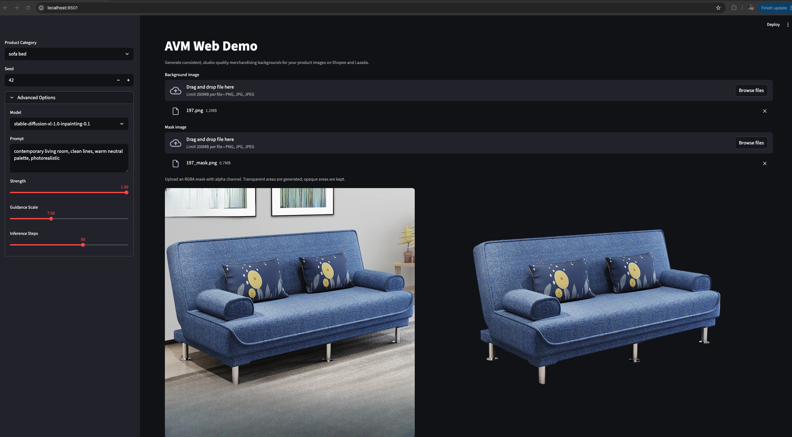

# VisionCommerce (Demo)

*VisionCommerce* tackles visual fragmentation for e-commerce platforms by scoring and standardising product images with state-of-the-art AI.



It consists of three main components:
1. **Image Scoring**: A fine-tuned DINOv2 model evaluates product images based on criteria like clarity, background quality, and overall aesthetics, assigning a score that reflects their suitability for e-commerce use.
2. **Mask Segmentation**: A fine-tuned SAM3 model generates precise masks to segment the product from its background, enabling targeted image editing and enhancement.
3. **Background Inpainting**: A fine-tuned FLUX.1-FILL model performs background inpainting to replace or enhance the background of product images, creating a consistent and appealing visual presentation across the platform.

The dataset used for training and evaluation is **BG60k**, a dataset specifically designed for e-commerce background generation and removal by JD.com ([paper](https://arxiv.org/pdf/2312.13309), [Github](https://github.com/Whileherham/BG60k)).

This project includes a Streamlit web demo, as well as notebooks for running inference and visualizing results. 

Contributors: [@bryanSwk](https://github.com/bryanSwk), [@j0kene](https://github.com/j0kene), [@xiaojun1402](https://github.com/xiaojun1402), [@nginyc](https://github.com/nginyc)

## Requirements

The app has been tested to run locally on **Apple Silicon (M-series Mac)** using [mflux](https://github.com/filipstrand/mflux) for on-device inference. RAM of 32 GB recommended (FLUX.1 with 8-bit quantization uses ~18 GB).

A **[SEA-LION API key](https://sea-lion.ai)** (`SEALION_API_KEY`) is required for the image scoring step.

## Setup

### Prerequisites

- **[pyenv](https://github.com/pyenv/pyenv)**
- **[uv](https://github.com/astral-sh/uv)**

### Getting Started

Install Python dependencies and set up virtual environment:
```sh
pyenv install
pyenv exec python -m venv ./.venv
. .venv/bin/activate
uv sync
```

Download fine-tuned model weights into the `models/` directory:
- **Fine-tuned DINOv2 model** for image scoring at `models/dinov2_vitb14_best.pth` from https://drive.google.com/file/d/1TXZJwTTe7lCsapk2lRHIYmP97424Xw0A/view?usp=sharing
- **Fine-tuned SAM3 model** for mask segmentation at `models/sam3_foreground_best-004.pth` from https://drive.google.com/file/d/12BNSW0Gk3Cu6Cd5jE1TUm_Wqr4XcAaZt/view?usp=sharing
- **Fine-tuned FLUX.1-FILL LoRA weights** for background inpainting at `models/flux1_fill.pytorch_lora_weights.safetensors` from https://drive.google.com/file/d/1bgteu8d69D62gp4oS3eWPMv_gv4l7kHk/view?usp=sharing

## Web Demo

```sh
. .venv/bin/activate
export HF_TOKEN=<your_hf_token>       # or: hf auth login
export SEALION_API_KEY=<your_api_key>
streamlit run app.py
```

Then open the local URL shown in the terminal.

Sample product images for testing are available in [`public/test_images/`](public/test_images/).

## Inference with Notebooks

The iPython notebooks in the `analysis/` folder contain code for running inference with the fine-tuned models on the subset of the test set of BG60k. Download the [original dataset](https://github.com/Whileherham/BG60k) and place the relevant files in `data/bg1k_imgs/`, `data/bg1k_masks/` and `data/bg1k_info.txt`.

## Model Training and Evaluation

The folders `scoring/`, `segmentation/` and `inpainting/` contain code for training and evaluating the image scoring, mask segmentation, and background inpainting models, respectively.
